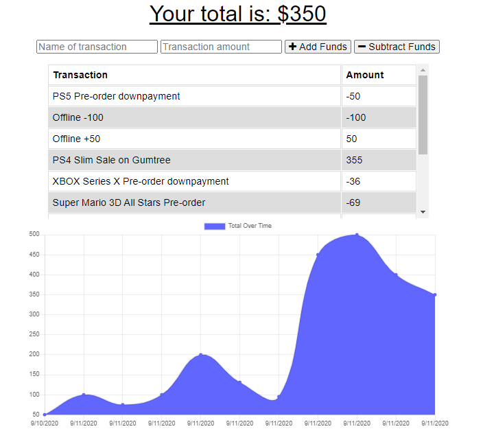
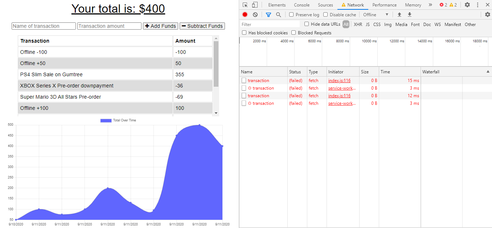
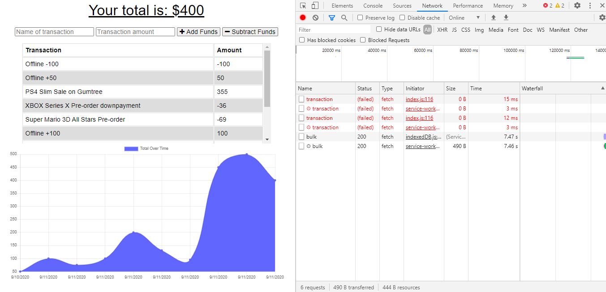

# budget-tracker

## Description: 
A budgeting app featuring IndexedDB, cache API, Service Workers and NoSQL (MongoDB).
This is the link to a preview of the application: https://peaceful-caverns-29244.herokuapp.com/ 

## Table of Contents 
* [Installation](#Installation) 
* [Usage Information](#Usage) 
* [Contributing](#Contributing) 
* [Test Instructions](#Tests) 
* [Questions](#Questions) 
* [License](#License)  

## Installation: 
1. Clone the Workout-Tracker project files to your local machine using this link: https://github.com/ong-osmond/budget-tracker.git  
2. Install NODE.js on your machine. Find the latest version on https://nodejs.org/en/
3. Open Git Bash or any Command Line tool and type in "NPM INSTALL". 
4. Install MONGO DB and run the MONGO DB service on your machine.

Note: The config "SERVER.JS" file handles the connections in the Heroku environment. The project preview uses the MONGODB_URI config variable to connect to the author's Mongo DB cluster.

## Usage: 

This is the budgeting app landing page:

The landing page displays the current budget Total and all transactions that have been entered so far.

To add to the budget, enter the name of the transaction and amount then click on Add Funds.

To subtract from the budget, enter the name of the transaction and amount then click on Subtract Funds.

You can still update the budget even while the app is offline:

To test this, access the browser's developer tools, select Network and set it Offline. Continue to enter transactions into the app. The transactions will be saved in the browser's IndexedDB and the app will still perform its functions.

Set the Network back to Online. The app will automatically reconnect to the DB and bulk transfer the IndexedDB (offline) data to the DB:

## Contributing: 
Everyone is welcome to contribute to this project. Please email me at ong.osmond@yahoo.com or fork the project from GitHub to your own repository.

## Tests: 
No tests have been implemented yet.
 
## Questions: 
Please visit my [GitHub Page](https://github.com/ong-osmond/) or email me your questions at ong.osmond@yahoo.com. 
I am available 8am-4pm Monday-Friday (Australian Western Standard Time). 

## License: 
MIT License

Copyright (c) 2020 Osmond Ong

Permission is hereby granted, free of charge, to any person obtaining a copy
of this software and associated documentation files (the "Software"), to deal
in the Software without restriction, including without limitation the rights
to use, copy, modify, merge, publish, distribute, sublicense, and/or sell
copies of the Software, and to permit persons to whom the Software is
furnished to do so, subject to the following conditions:

The above copyright notice and this permission notice shall be included in all
copies or substantial portions of the Software.

THE SOFTWARE IS PROVIDED "AS IS", WITHOUT WARRANTY OF ANY KIND, EXPRESS OR
IMPLIED, INCLUDING BUT NOT LIMITED TO THE WARRANTIES OF MERCHANTABILITY,
FITNESS FOR A PARTICULAR PURPOSE AND NONINFRINGEMENT. IN NO EVENT SHALL THE
AUTHORS OR COPYRIGHT HOLDERS BE LIABLE FOR ANY CLAIM, DAMAGES OR OTHER
LIABILITY, WHETHER IN AN ACTION OF CONTRACT, TORT OR OTHERWISE, ARISING FROM,
OUT OF OR IN CONNECTION WITH THE SOFTWARE OR THE USE OR OTHER DEALINGS IN THE
SOFTWARE.
